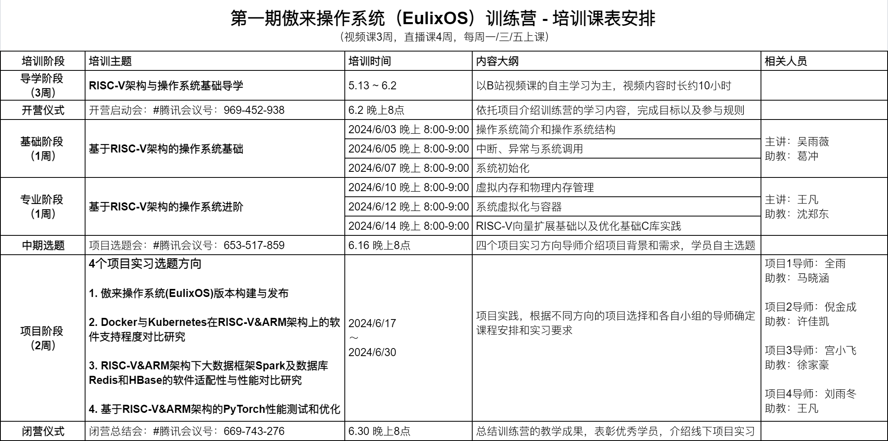

## 开营仪式教学安排与资料汇总

**训练营开营启动会**

会议时间：2024/06/02 20:00[视频回放(密码：0602)](https://meeting.tencent.com/user-center/shared-record-info?id=cea43f5d-e061-43dd-8281-5ca765a42d7c&from=3&record_type=2)

**训练营开营启动会安排**

* 8:00 主持人唐涵主持开场，介绍与会老师与嘉宾

* 8:02  武延军所长致辞
* 8:07  陈渝老师致辞
* 8:12  于佳耕老师致辞，介绍 RISC-V 当前生态及未来发展方向展望
* 8:27  常秉善介绍本次训练营报名及课程开设介绍
* 8:42  王凡介绍本次训练营的基础与专业阶段并分享学习经验
* 8:57  姬晨晨介绍本次训练营项目阶段的选题方向和实践
* 9:12  于佳耕老师总结寄语
* 9:15  主持人介绍组队宣传，及引导训练营问题答疑

**训练营教学安排**

**傲来操作系统（EulixOS）官网**

[中科傲来](https://eulixos.com/)

[傲来操作系统下载](https://eulixos.com/#/download)

**傲来操作系统1.0使用手册**

[EulixOS1.0使用手册](https://eulixos.com/userguide/)

