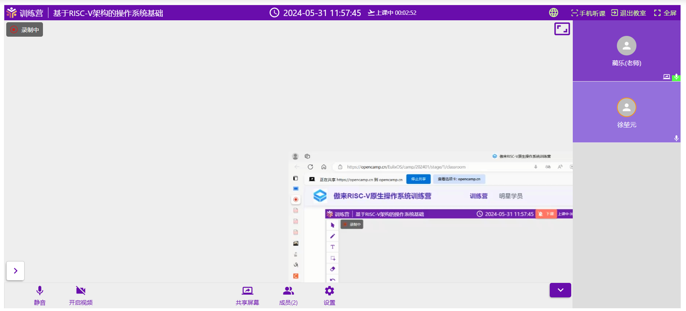

## 教学系统常见问题与解决方案

### 1.pc 端教室画面显示异常

目前发现在 edge 浏览器中可能出现分享页面显示不全的情况，使用 Chrome 浏览器可以解决这一问题。

**建议在 PC 端使用 Chrome 浏览器听课，防止出现类似问题。**

### 2.组队页面无法自己组建队伍

一般每阶段限制每人只能加入一支队伍，如果产生类似情况请先确认自己是否加入了或已经创建了队伍，如存在类似情况，请先退出/解散当前队伍，而后重新创建。

如果不存在类似情况请确认已经登录到教学系统，如确认后依然无法创建队伍请联系管理员。

### 3.进入教室后发现没有声音

请确认是否正确给予了教室页面需要的权限，或检查本地设备是否正确配置，如感觉授课老师声音较小可在聊天区向老师提出。

### 4.晋级榜单上的成绩没有准确链接到用户信息

请确保在个人信息页面正确填写了 GitHubName/GiteeName，确认正确填写后再做一次提交便可正确链接到用户信息。
