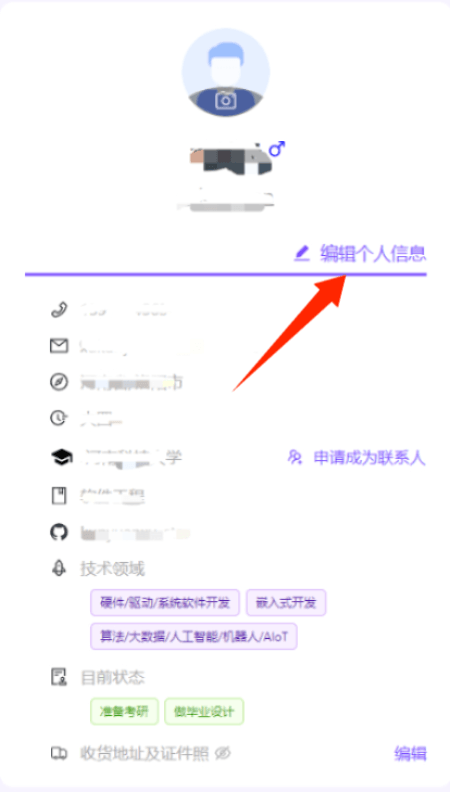
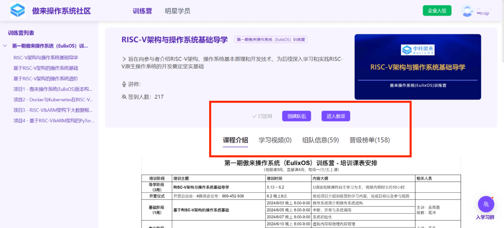
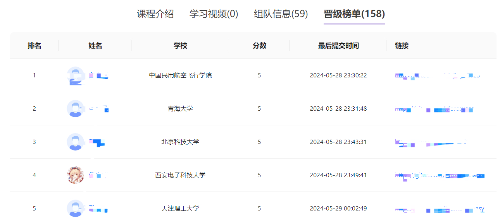

## 训练营教学系统使用引导

**训练营教学系统导学阶段链接**

https://opencamp.cn/EulixOS/camp/202401/stage/0

### 个人信息管理

如图所示，通过右上角显示的昵称，选择个人中心，进入个人信息管理。

通过这里的编辑个人信息可以对自己的信息进行补充和修改。

**注：为了确保实验成绩在排行榜上正确显示，请确保正确填写了 GitHubName/GiteeName。**

### 如何听课

1.首先，你需要进行课程签到，如未完成签到，签到按钮会显示于红圈内“已签到”位置。

2.完成签到后可在上课时间点击“进入教室”听课，课程回放会在直播课程结束后于“学习视频”页面上架。

### 教室使用

进入教室时需要确保给与当前页面足够的权限。

如有需要可通过左下角聊天框向老师提问。

如发现电脑端听课不便，可通过右上角“手机听课”在手机端听课。

**注：请优先使用 Chrome 浏览器听课。**

### 成绩查看

实验的最终成绩会显示在晋级榜单页面，此处会显示排名、姓名（授课系统昵称）、学校（如在个人信息内填写）、分数与其他信息。

**排行榜上显示的成绩将会作为个人晋级的依据。**

### 组队

训练营允许且鼓励学员组队学习，组队的操作位于“组队信息页面”。关于组队的操作说明如下：

1. 只有队长可以创建/解散队伍，其余队员只可加入退出。
2. 包含队长在内，不少于两人的队伍为有效组队，不允许“单人成队”。
3. 训练营为全员晋级的队伍的队长发放奖品作为鼓励。
4. 组队情况不影响单人晋级。
