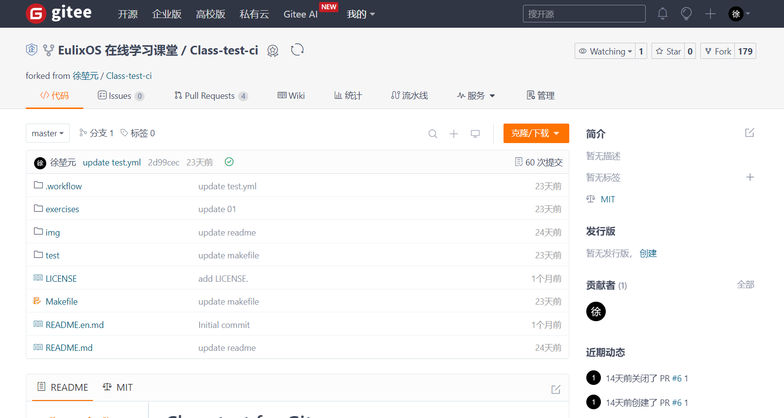

## Gitee 使用入门

Gitee 是一个基于 Git 的代码托管和协作平台，它提供了代码仓库管理、代码审查、问题跟踪、持续集成和部署等功能。以下是 Gitee 使用的一些基本步骤和技巧。

### Gitee 基本功能的使用



打开某一仓库后的 Gitee 页面如上图所示

##### 1. 注册与登录

访问 [Gitee 官网](https://gitee.com/)，点击右上角的“注册”按钮进行账号注册。你需要提供邮箱地址、用户名和密码。注册完成后，使用你的用户名和密码登录 Gitee。

##### 2. 创建仓库

登录后，点击页面右上角的“+”号，选择“新建仓库”。在创建仓库页面，填写仓库名称、选择仓库的可见性（公开或私有）、添加仓库描述、选择是否初始化仓库以及是否添加 README、.gitignore 和开源许可证等文件。完成设置后，点击“创建仓库”。

##### 3. 仓库管理

在仓库页面，通过最右侧的“管理”你可以进行多种管理操作：

- **基本信息**：编辑仓库的名称、描述、可见性等。
- **分支保护**：设置分支保护规则，防止重要分支被错误地修改或删除。
- **WebHooks**：配置 WebHooks，当仓库发生特定事件（如推送代码）时，自动触发外部服务。
- **部署密钥**：添加部署密钥，允许服务器无密码访问仓库。
- **成员管理**：邀请其他用户加入仓库，并设置他们的权限级别。

##### 4. 克隆仓库

在仓库页面，找到“克隆/下载”按钮，选择 HTTPS 或 SSH 方式获取仓库的 URL。然后，在本地命令行中使用 `git clone` 命令将仓库克隆到本地：

```bash
git clone https://gitee.com/username/repository.git
```

##### 5. 提交与推送

在本地仓库进行修改后，使用以下命令将更改提交到 Gitee 仓库：

```bash
git add .
git commit -m "Update README"
git push origin master
```

##### 6. 拉取更新

如果远程仓库有更新，使用 `git pull` 命令将更新拉取到本地：

```bash
git pull origin master
```

##### 7. 分支管理

在 Gitee 仓库页面，你可以创建、删除和管理分支。在本地，使用以下命令进行分支操作：

```bash
git branch feature-x  # 创建新分支
git checkout feature-x  # 切换到新分支
git merge feature-x  # 将 feature-x 分支合并到当前分支
git branch -d feature-x  # 删除 feature-x 分支
```

##### 8. 问题跟踪

在仓库页面，点击“问题”标签，然后点击“新建问题”按钮创建问题。你可以为问题添加标签、指派负责人、设置截止日期等。

##### 9. 代码审查

在仓库页面，点击“合并请求”标签，然后点击“新建合并请求”按钮。选择源分支和目标分支，填写请求信息，然后提交。其他开发者可以审查代码并提供反馈。

##### 10. 持续集成

在仓库页面，点击“流水线”标签，然后点击“新建流水线”按钮。配置流水线，设置触发条件、构建环境、构建脚本等。提交后，流水线将自动执行代码的构建、测试和部署。**更详细的介绍会在之后讲解**

##### 11. 使用 Gitee Pages

在仓库页面，点击“服务”下的“Gitee Pages”，然后点击“启动”按钮。配置部署分支和目录，提交后，Gitee Pages 将自动部署你的静态网站。

##### 12. 团队协作

在仓库页面，点击“管理”标签，然后选择“仓库成员管理”。你可以邀请其他用户加入仓库，并设置他们的权限，如只读、写入或管理员。

##### 13. 使用 Gitee API

Gitee 提供了 [API 文档](https://gitee.com/api/v5/swagger#/getV5ReposOwnerRepo)，你可以通过 API 自动化管理仓库、问题、合并请求等。

##### 14. 安全设置

在仓库页面，点击“管理”标签，然后选择“仓库设置”。你可以设置仓库的访问权限、分支保护规则、部署密钥等，确保仓库安全。

##### 15. 学习资源

Gitee 提供了[帮助中心](https://gitee.com/help)，你可以在那里找到各种教程、指南和最佳实践，帮助你更好地使用 Gitee。

**注：Gitee 平台的部分操作需要在完成实名认证后才能进行，请在注册账号后尽快进行实名认证。**
