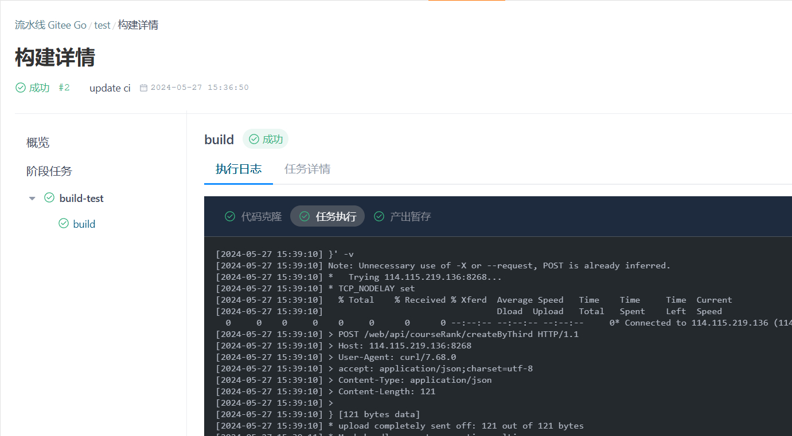

## 流水线测试过程

**流水线配置**

```yaml
version: '1.0'
name: test
displayName: test
triggers:
  trigger: auto
  push:
    branches:
      prefix:
        - ''
variables:
  POST_API: ***
stages:
  - name: build-test
    displayName: build-test
    strategy: naturally
    trigger: auto
    executor: []
    steps:
      - step: build@gcc
        name: build_gcc
        displayName: build
        gccVersion: '9.4'
        commands:
          - apt-get update
          - ''
          - apt-get install -y curl
          - ''
          - mkdir build
          - ''
          - make test-output
          - ''
          - make save-test-results
          - ''
          - gitee_id="$GITEE_PIPELINE_TRIGGER_USER"
          - ''
          - json_file="build/test_results.json"
          - ''
          - existing_json=$(cat "$json_file")
          - ''
          - updated_json=$(echo "$existing_json" | jq --arg gitee_id "$gitee_id" '.name = $gitee_id')
          - ''
          - echo "$updated_json" > "$json_file"
          - ''
          - cat build/test_results.json
          - ''
          - 'curl -X POST "$POST_API" -H "accept: application/json;charset=utf-8" -H "Content-Type: application/json" -d "$(cat build/test_results.json)" -v'
          - ''
          - ''
        artifacts:
          - name: test_results
            path:
              - ./build/test_results.json
        caches: []
        notify: []
        strategy:
          retry: '0'

```

流水线的配置文件定义了一个名为“test”的流水线，它具有自动触发的特性。该流水线包含一个阶段（stage），名为“build-test”，其目的是构建和测试代码。

其包含以下几个步骤：

**环境准备** 

在“build-test”阶段中，首先执行的是环境准备步骤。这包括更新包列表（apt-get update）和安装必要的软件（apt-get install -y curl）。这些步骤确保了构建和测试环境的一致性和可用性。

**构建与测试**

接下来，流水线创建一个名为“build”的目录，并在其中执行构建命令（make test-output）和保存测试结果的命令（make save-test-results）。这些命令是构建和测试过程的核心。

**结果处理**

测试完成后，流水线会读取build/test_results.json文件中的测试结果，并使用jq工具更新其中的giteeName字段。这一步骤确保了测试结果中包含了执行流水线的用户的Gitee ID。

**结果提交**

更新后的测试结果通过curl命令被发送到指定的API（$POST_API）。这一步骤实现了测试结果的自动化提交，使得测试结果可以被远程服务器接收和处理。

**结果归档**

最后，流水线将build/test_results.json文件作为构建产物（artifact）归档，以便后续的分析和审查。

### 如何进行流水线测试

完成实验后，请上传至远程仓库运行 CI。详细执行情况与输出可在流水线页面查看。


