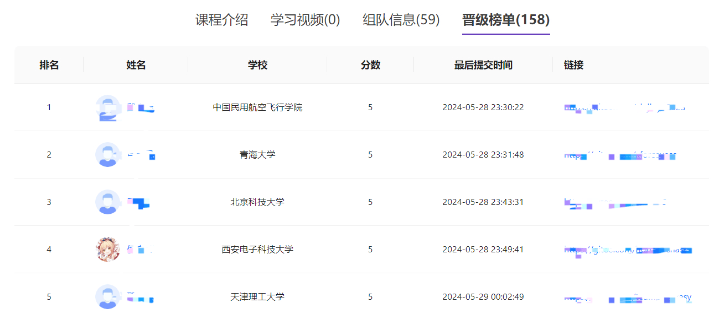

## 排行榜成绩查看与绑定

**导学阶段排行榜地址**

[导学阶段晋级榜单](https://opencamp.cn/EulixOS/camp/202401/stage/0?tab=rank)

在通过在线的 CI 评测后，你的成绩会被发送到训练营的排行榜上。

如图所示，排行榜上显示了你的排名，姓名（昵称），分数，最后提交时间等信息，排行榜上的成绩作为晋级的一大依据。

**请注意：为了确保成绩被正确绑定，请在训练营网站上正确填写 GitHubName/GiteeName**

